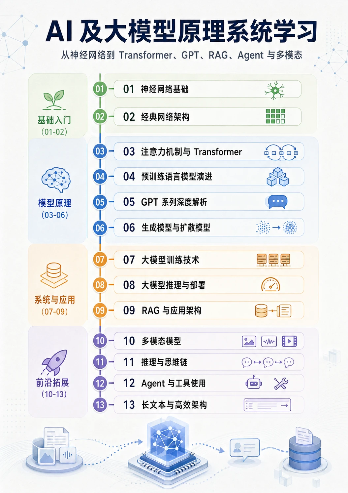

# AI 及大模型原理系统学习

这是一份面向有编程经验、但 AI 原理基础不多的读者的概念学习材料。
它的重点不是训练你做论文复现或工程调参，而是帮你把 AI 与大模型的主线串起来：
    神经网络如何学习，
    Transformer 为什么重要，
    GPT 为什么能生成内容，
    RAG、Agent、多模态和推理模型又分别在补什么能力。
读完后，你应该能更稳地看懂 AI 相关术语、技术脉络和常见讨论，不会一听到 Attention、Scaling Laws、RLHF、KV Cache、Embedding、CoT、Agent 就只能点头。

## 适合谁

- 有基本 Python 或编程经验，想补 AI 与大模型原理主线的人。
- 经常使用 AI 工具，但想知道它们大致怎样工作的人。
- 希望看懂技术讨论、产品能力边界和常见概念，而不是立刻投入论文复现的人。

## 内容特点

- **GPT-5.5 生成正文，先把概念讲清楚**：每节优先回答“是什么、为什么出现、解决什么问题、和前后技术有什么关系”，先建立准确概念定义，再补必要细节。
- **GPT-Image-2 生成配图，让机制有画面**：配图同时保留专业结构和生动类比，用图示帮助理解神经网络、注意力、扩散、RAG、Agent 这类抽象机制。
- **完整 13 章主线，串起技术关系**：从神经网络基础一路串到 Transformer、GPT、生成模型、训练推理、RAG、多模态、推理模型、Agent 和长文本架构，帮你看清上下游关系。
- **强调边界和判断力**：读完后不只是“听过这些词”，而是能判断一个概念大概属于哪一层、解决什么问题、哪些流行说法可能不严谨。
- **轻量但不浅薄，按需深入**：主线尽量顺着直觉走，必要的数学、代码和工程细节放在附录或后续章节，需要时再深入，不打断第一次阅读。
- **适合连续阅读**：README 适合快速了解全貌，HTML 版本提供完整目录、章节跳转和配图，更适合一章一章读下去。

内容中的前沿部分整理到 2026 年 4 月。AI 发展很快，具体模型排名、产品能力和工程框架细节需要结合阅读时的新资料判断。

## 推荐入口

- **HTML 版本**：本地打开 `html/index.html`，适合连续阅读；左侧有完整目录，已配置章节配图。
- **Markdown 版本**：先看 [AI 学习目录索引](AI学习目录索引.md)，按目标选择阅读路径。
- **模块入口**：每个 `AI学习_*` 文件夹下的 `README.md` 是该模块的导读页。
- **附录**：[术语速查](附录_术语速查.md)、[数学基础速览](附录_数学基础速览.md)、[代码示例集](附录_代码示例集.md) 按需查阅。

## 怎么读

不要把所有章节都当成同一条必修线。先选目标，再顺着问题往下读：

| 目标 | 建议读法 |
|------|----------|
| 先看懂 GPT 主线 | 走索引中的“核心原理快速路径” |
| 想串起语言、图像、视频生成 | 走“完整模型原理路径” |
| 更关心训练、推理、RAG、Agent | 走“完整大模型系统路径” |
| 想完整浏览一遍 | 走“全量学习路径” |

阅读时优先问四个问题：它是什么？为什么出现？解决什么问题？和前后技术有什么关系？如果连续几节都只是“词认识、关系不清”，先回到最近的前置模块补地基。

## 内容结构



| 模块 | 主题 | 你会看懂什么 |
|------|------|--------------|
| [01 神经网络基础](AI学习_01_神经网络基础/README.md) | 感知机、激活函数、损失函数、反向传播、优化器、正则化 | 神经网络如何从数据和反馈中更新参数 |
| [02 经典网络架构](AI学习_02_经典网络架构/README.md) | CNN、RNN、LSTM、Seq2Seq | 深度学习在 Transformer 之前如何处理图像和序列 |
| [03 注意力机制与 Transformer](AI学习_03_注意力机制与Transformer/README.md) | Attention、Self-Attention、Transformer、位置编码 | Transformer 为什么成为大模型的核心底座 |
| [04 预训练语言模型演进](AI学习_04_预训练语言模型演进/README.md) | Word2Vec、ELMo、BERT、GPT、预训练与微调 | 语言模型如何从词向量走向通用预训练 |
| [05 GPT 系列深度解析](AI学习_05_GPT系列深度解析/README.md) | GPT 演进、Scaling Laws、涌现、RLHF/DPO | GPT 如何从补全文本变成通用能力平台 |
| [06 生成模型与扩散模型](AI学习_06_生成模型与扩散模型/README.md) | VAE、GAN、Diffusion、Stable Diffusion | 图像和视频生成为什么常用“加噪再去噪” |
| [07 大模型训练技术](AI学习_07_大模型训练技术/README.md) | 分布式训练、混合精度、数据工程、对齐训练 | 大模型训练为什么难、成本主要花在哪里 |
| [08 大模型推理与部署](AI学习_08_大模型推理与部署/README.md) | KV Cache、量化、vLLM、推测解码、Prompt Engineering | 模型生成为什么慢，常见优化在优化什么 |
| [09 RAG 与应用架构](AI学习_09_RAG与应用架构/README.md) | Embedding、向量数据库、Chunking、检索增强生成 | 为什么模型需要外部知识库，以及 RAG 的瓶颈在哪里 |
| [10 多模态模型](AI学习_10_多模态模型/README.md) | ViT、CLIP、视觉语言模型、语音与视频多模态 | 图像、语音和视频如何接入语言模型 |
| [11 推理与思维链](AI学习_11_推理与思维链/README.md) | CoT、ToT、推理模型、Test-time Compute | 模型“多想一会儿”为什么可能答得更好 |
| [12 Agent 与工具使用](AI学习_12_Agent与工具使用/README.md) | ReAct、工具调用、记忆、规划、多 Agent、MCP | Agent 为什么不只是多轮聊天 |
| [13 长文本与高效架构](AI学习_13_长文本与高效架构/README.md) | RoPE 扩展、Ring Attention、MoE、Mamba/SSM | 长上下文和高效架构分别在优化什么 |

更详细的路径、前置关系和推荐节奏见 [AI 学习目录索引](AI学习目录索引.md)。

## HTML 生成

本仓库已生成 `html/` 静态页面。需要重新生成时运行：

```powershell
python scripts/generate_html.py --all --output html --clean
```

配图由 `imgCfg.json` 控制。`imgLocalPath` 有值时会在 HTML 中渲染图片；为空或文件不存在时，会显示 `[缺图：图片位置Id]` 占位，方便后续补图。

仓库中的 `.github/workflows/static.yml` 会在推送到 `main` 后部署 `html/` 到 GitHub Pages。Pages 地址以 GitHub Actions 部署结果或仓库 Pages 设置中显示的地址为准。

## License

本项目内容仅供个人学习使用。
